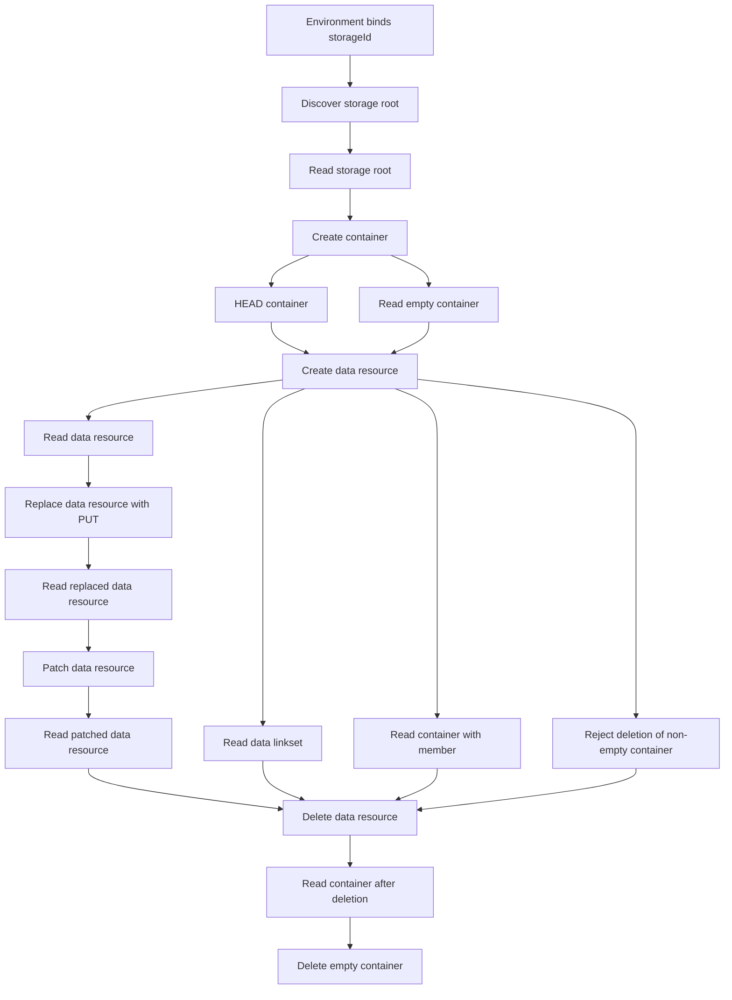
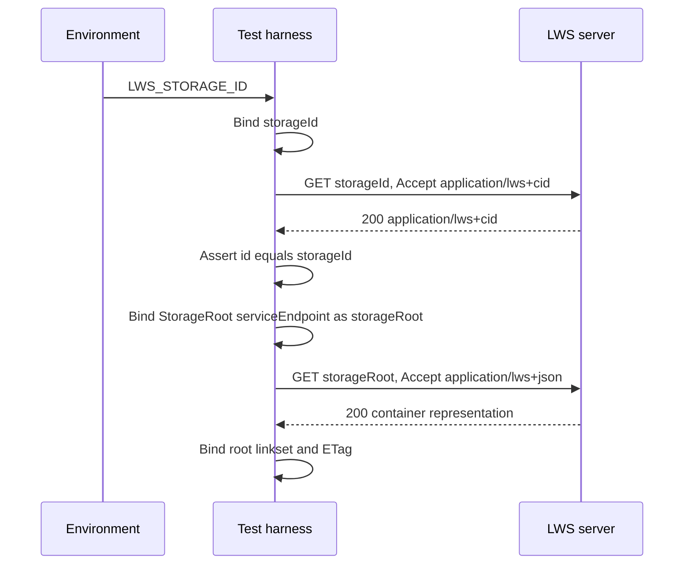
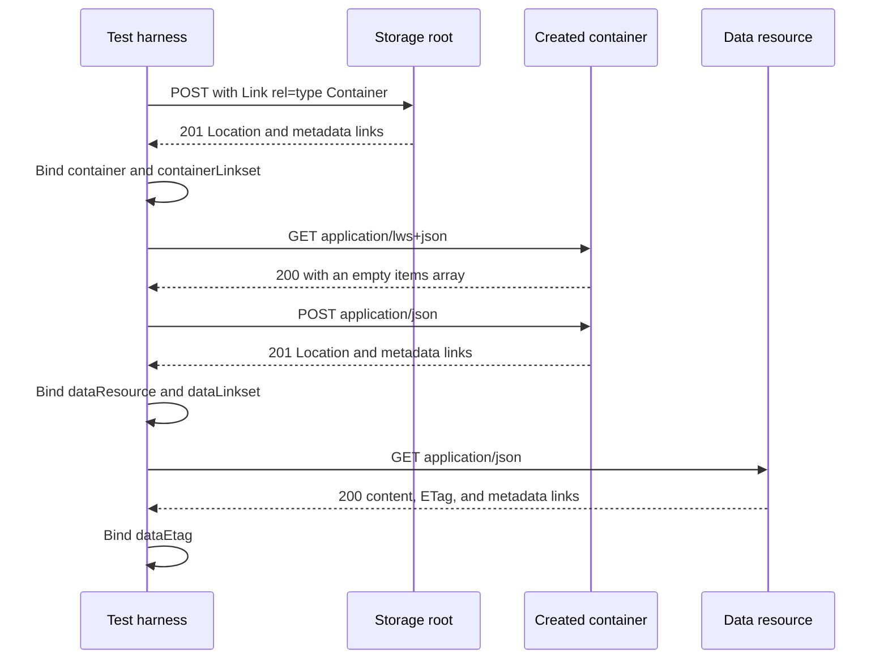
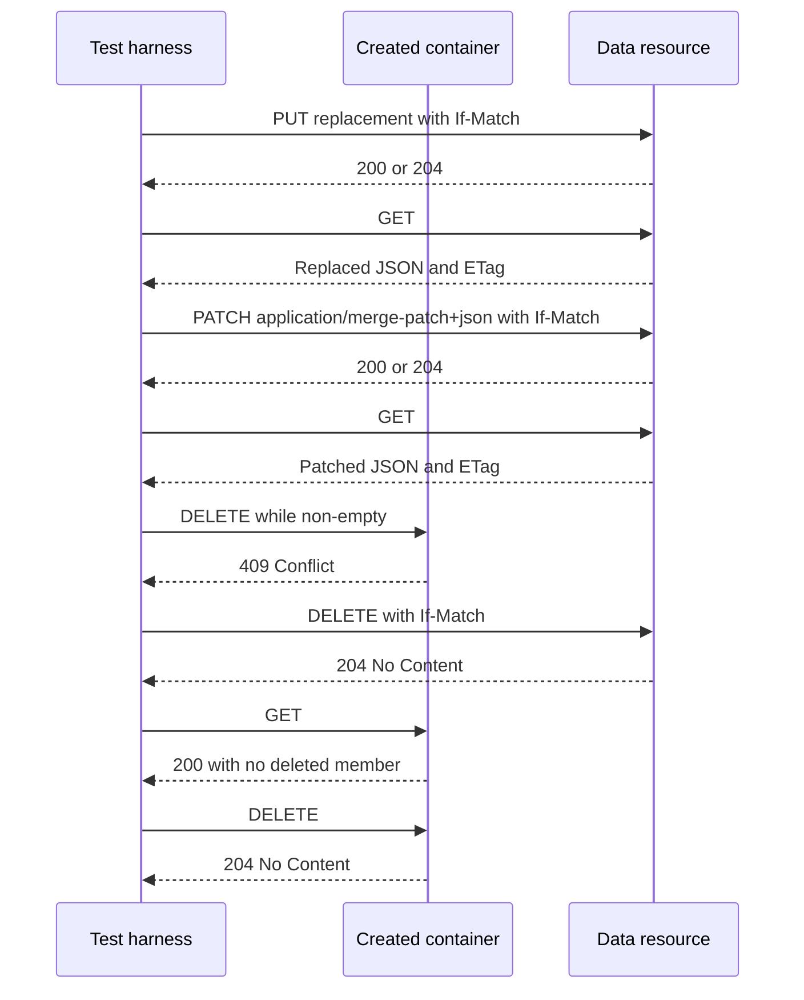

# LWS discovery and REST manifest discussion draft

This document explains the proposed execution model in
[`manifest.yaml`](./manifest.yaml). It is intended for Task Force discussion,
not as a settled test-manifest vocabulary.

The protocol assertions were reviewed against the
[LWS Protocol 1.0 editor's draft](https://w3c.github.io/lws-protocol/lws10-core/)
at revision
[`8a007c09f9b8a067a19f003de5fa47c9fee00980`](https://github.com/w3c/lws-protocol/commit/8a007c09f9b8a067a19f003de5fa47c9fee00980).
Pinning the revision matters because the editor's draft is changing rapidly.

## Scope

The draft covers:

- loading the storage identifier from `LWS_STORAGE_ID`;
- retrieving the storage description as `application/lws+cid`;
- discovering the `StorageRoot` service endpoint;
- reading and creating containers;
- creating, reading, replacing, patching, and deleting a data resource;
- reading the data resource's linkset;
- checking containment before and after deletion; and
- rejecting non-recursive deletion of a non-empty container.

Authentication and authorization are intentionally out of scope. The harness
and implementation under test need to arrange sufficient access for these
operations. The manifest does not assert how that access is provided.

## Current-spec changes reflected by the draft

The previous manifest predates several concepts in the current specification.
This draft reflects the following current requirements:

- The input is the canonical **storage identifier**, not a hard-coded storage
  description path.
- A request to the storage identifier retrieves the storage description.
- The canonical storage description representation uses
  `application/lws+cid`.
- Its `@context` array starts with the CID and LWS contexts.
- Its `id` equals the canonical storage identifier and its `type` includes
  `Storage`.
- Its `service` set contains a `StorageRoot` service whose `serviceEndpoint`
  identifies the storage root container.
- GET and HEAD responses for storage resources link to the canonical storage
  identifier using `rel="https://www.w3.org/ns/lws#storage"`.
- A container representation contains `id`, `type`, `totalItems`, and `items`.
- Read responses have an `ETag` and resource metadata links.
- Creation uses POST to a container and returns `201`, `Location`, `up`, and
  `linkset` links.
- JSON Merge Patch is the minimum required PATCH format.
- Successful deletion returns `204`.
- Deleting a non-empty container without recursive deletion returns `409`.

## Variable and unification model

Variables are JSON-LD resources with stable URNs:

```yaml
- "@id": urn:lws-tests:variables:storageId
  "@type": Variable
  input:
    environment: LWS_STORAGE_ID
```

The harness binds `storageId` before executing any test. A variable reference in
a request reads an existing binding:

```yaml
request:
  method: GET
  url:
    "@id": urn:lws-tests:variables:storageId
```

A variable reference in a response unifies with the observed value. If the
variable is unbound, the response binds it:

```yaml
response:
  headers:
    - fieldName: Location
      fieldValue:
        "@id": urn:lws-tests:variables:dataResource
```

If it is already bound, the same expression asserts equality. This allows a
later `up` link, container member identifier, or storage link to be checked
against a value observed earlier.

URL-valued observations, including `Location`, Link targets, and
`serviceEndpoint`, should be resolved against the effective response URL before
they are bound. This gives later steps absolute URLs even when an implementation
uses relative references on the wire.

An unbound variable in a request is an execution error. Rebinding a variable to
a different value is a test failure.

## Prerequisites form a DAG

Every `ValidationTest` is a node. A prerequisite reference creates a directed
edge from the prerequisite to the dependent test:

```yaml
prereqs:
  - "@id": "#read-data-resource"
```

For a selected test, the harness:

1. computes its transitive prerequisite closure;
2. rejects cycles;
3. executes each node once in topological order; and
4. shares one variable-binding scope across those nodes.

Sibling prerequisite entries are unordered. They must not depend on which one
runs first. When an order is required, it must be represented by another edge.
The DAG permits parallel execution, but does not require it. A sequential
topological execution is safer for stateful REST tests.

### Complete draft graph



The four branches following creation are read-only except for the negative
DELETE check, which must leave the non-empty container unchanged when it
correctly returns `409`. They converge before the successful data-resource
deletion.

## Discovery flow

The storage identifier is both the canonical identifier in the storage
description and the URL used to retrieve that description. The storage root is
discovered from the `StorageRoot` service rather than constructed from the
storage identifier.



The storage root does not have a parent, so the draft does not require an `up`
link from it. Created descendants do require `up` links.

## Container and data-resource flow

The harness does not provide a fixed slug. The server assigns identifiers and
the harness captures each `Location`, avoiding assumptions about URL layout.



## Update and deletion flow

The draft uses ETags observed by preceding GET requests as `If-Match` values.
The current specification permits either `200` or `204` for successful PUT and
PATCH updates. DELETE success is specifically `204`.



## Proposed response matching operators

The YAML introduces a small shape language for discussion:

| Operator | Meaning |
| --- | --- |
| `@present` | The field or header exists. |
| `@absent` | The response body or field does not exist. |
| `@datatype` | The observed value has the named scalar datatype. |
| `@oneOf` | The observed scalar equals one listed value. |
| `@includes` | A scalar equals the value, or an array includes it. |
| `@contains` | An array contains an item matching the supplied partial shape. |
| `@notContains` | No array item matches the supplied partial shape. |
| `@startsWith` | An array starts with the supplied sequence. |
| `@mediaType` | The parsed media type matches, ignoring parameters. |
| `@containsToken(s)` | A structured comma-separated header contains tokens. |

Objects without an operator are partial object shapes: listed properties must
match and unlisted properties are allowed. Response `headers` and `links` are
also subset assertions, so extensions and additional protocol links do not
cause failures.

These operators are placeholders for a future schema or shape vocabulary. The
Task Force may prefer SHACL, ShEx, JSON Schema, or another established
mechanism. The behavioral requirements are more important than these draft
operator names.

## Open questions

1. Should variable inputs name environment variables in the manifest, or should
   the runner map CLI/environment values to variable URNs externally?
2. Should variable producers and consumers be declared explicitly for static
   DAG validation, or inferred from request and response positions?
3. Should each selected terminal test receive a fresh server fixture, or should
   this whole graph be one named scenario with cleanup?
4. Should tests for normative SHOULD requirements be separate from baseline
   MUST-level conformance tests?
5. Which existing shape language should replace the provisional `bodyShape`
   operators?
6. How should the harness arrange access while authentication and authorization
   remain outside this draft's scope?
